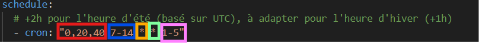

# Surveillance d'annonces Complétude

Bot python qui envoie une alerte mail lorsqu'une annonce de cours Complétude dans une des villes choisies est postée.

## Fonctionnalités :  
- Laps de temps entre chaque exécution du script  
- Choix des jours d'éxécution et de la plage horaire  
- Choix des villes à surveiller  
- Envoie d'un mail d'alerte à un ou plusieurs destinataires  
- Exécution du script via Github Actions grâce aux Github Secrets  

    
## Déployer en local :  
- Cloner le dépôt : git clone https://github.com/Maxence-Van-Laere/bot_annonce_completude.git
- Installer les dépendances : pip install -r requirements.txt
- Installer les navigateurs Playwright : playwright install
- Créer un environnement et définir les variables d'environnements (aide dans l'index ci-dessous)
- Exécution du script : python alerte_bot.py 

## Déployer via Github actions :  
- Cloner le dépôt  
- Dans workflows.yml : modifiez la section schedule selon votre convenance (aide ci-dessous)  
- Créer un nouveau repos sur Github, push le projet sur le repos distant (vérfier que le fichier "workflows.yml se trouve bien dans .github/workflows")  
- Dans le dépôt, Settings > Secrets and variables > Actions, créer a "New Repository Secret" pour chacun des variables listées dans le workflows.yml (env) et y renseigner les valeurs (vous pouvez vous aider de l'index ci-dessous)  

**Guide schedule:**  
  
🔴 Rouge : à quelles horaires (minutes) ?  
🔵 Bleu : quelles plages horaires ?  
🟠 Orange : quels jours dans la semaine ?  
🟢 Vert : quels mois ?  
🟣 Rose : quels jours de la semaine ?

**Variables d'environnements:**  
- **VILLE_CIBLES** : Liste des villes à surveiller, séparées par des virgules
- **EMAIL_SENDER** : Adresse e-mail utilisée pour envoyer les alertes
- **EMAIL_PASSWORD** : Mot de passe ou mot de passe d'application associé à l’adresse EMAIL_SENDER.
- **EMAIL_RECIPIENTS** : Liste des destinataires (adresse mail) des alertes, séparés par des virgules
- **ADRESSE_PERSONNELLE** : Ton adresse postale personnelle (obligatoire pour trouver des annonces)
- **USER_ID** : Identifiant utilisé pour te connecter à Complétude
- **USER_PASSWORD** : Mot de passe associé au USER_ID pour se connecter à Complétude